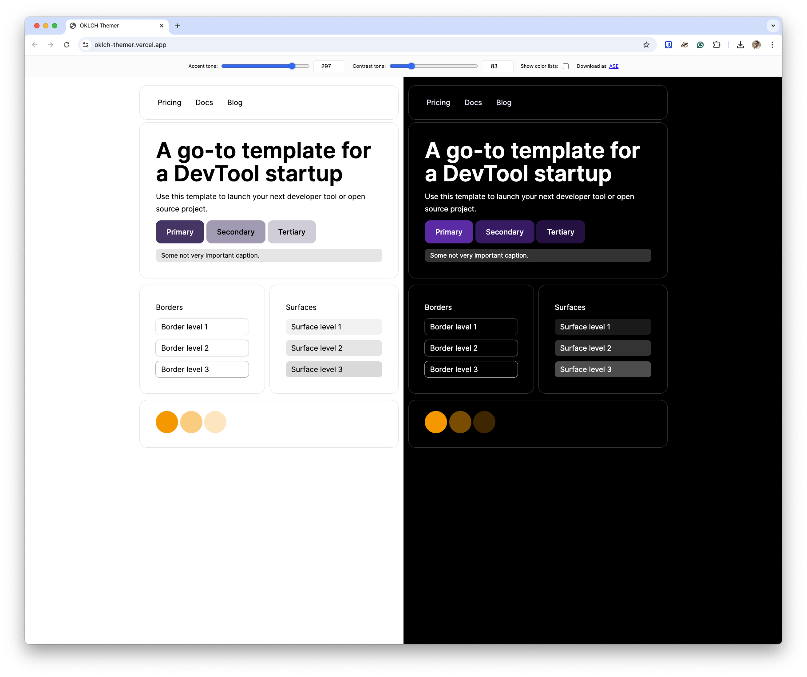

# OKLCH Themer

> Based on <https://codepen.io/romanshamin/full/WbNxqPp>

## Usage

On <https://oklch-themer.vercel.app>, you can adjust the accent and contrast color and derive a color palette from it. Additionally, you can download the color palette as an Adobe Swatch Exchange (ASE) file. You can also check the color contrast ratio by hovering over the buttons and contrast circles.

## OkLch

- <https://hybridheroes.de/blog/2023-04-27-rgb-hsl-oklch/>
- <https://hybridheroes.de/blog/consistent-ui-color-palettes/>
- <https://evilmartians.com/chronicles/better-dynamic-themes-in-tailwind-with-oklch-color-magic>
- <https://evilmartians.com/chronicles/exploring-the-oklch-ecosystem-and-its-tools>
- <https://evilmartians.com/chronicles/oklch-a-color-picker-made-to-help-think-perceptively>
- <https://harmonizer.evilmartians.com/>
- <https://oklch.com/>
- <https://colorjs.io/>
- <https://oklch-palette.vercel.app/>
- <https://huetone.ardov.me/>

## Adobe Swatch Exchange (ASE)

- <https://www.cyotek.com/blog/reading-adobe-swatch-exchange-ase-files-using-csharp>
- <https://community.adobe.com/t5/indesign-discussions/how-to-write-adobe-swatch-exchange-ase-file/td-p/10768705?profile.language=de>
- <https://www.selapa.net/swatches/colors/fileformats.php#adobe_ase>
- <https://bun.sh/guides/binary/typedarray-to-blob>
